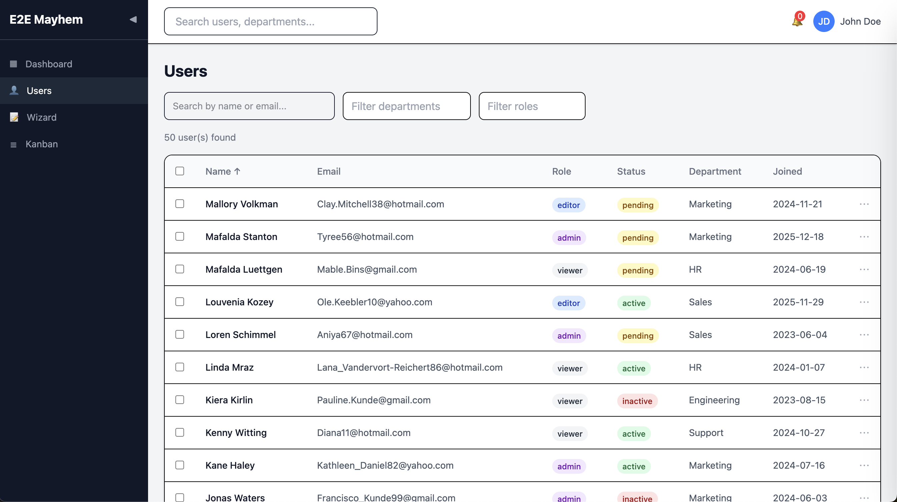

# E2E Mayhem

Can Claude Code write e2e tests that actually catch bugs? I built a complex React app, injected 20 subtle bugs, and ran three independent test-writing sessions to find out.

## The Setup

Claude Code generated a full React app (React 19, TypeScript, Vite, Tailwind, React Router, drag-and-drop) with five pages: Login, Dashboard, Users table, multi-step Wizard, and Kanban board. No backend -- everything runs in-memory with deterministic faker data.

Then we injected 20 single-line bugs -- the kind that pass type-checking and look fine at a glance. Off-by-one errors, inverted conditions, swapped labels, missing validations. Each one is a realistic mistake a developer might actually make.



## Three Approaches

We gave three separate Claude Code sessions the same bugged codebase and asked each to write comprehensive Playwright tests. None were told about the bugs.

**Blind** -- source code only. No exploration, no screenshots, no accessibility trees.

**Guided** -- source code plus exploration output: per-page JSON with all test IDs, interactive elements, accessibility trees, and screenshots.

**Spec-first** -- two phases. First, Claude read the source and wrote a behavioral spec describing what each feature *should* do (based on naming, error messages, and API contracts -- not what it literally does). Then a second session wrote tests from the spec alone, never seeing the source.

## Results

| # | Bug | Blind | Guided | Spec-first |
|---|-----|:-----:|:------:|:----------:|
| 01 | Pagination off-by-one | -- | -- | :white_check_mark: |
| 02 | Sort direction inverted | :white_check_mark: | -- | :white_check_mark: |
| 03 | Search filter case-sensitive | :white_check_mark: | :white_check_mark: | -- |
| 04 | Login accepts short passwords | :white_check_mark: | -- | :white_check_mark: |
| 05 | Confirm password not validated | :white_check_mark: | :white_check_mark: | :white_check_mark: |
| 06 | Password toggle wrong aria-label | -- | -- | :white_check_mark: |
| 07 | Wizard skips company validation | :white_check_mark: | :white_check_mark: | :white_check_mark: |
| 08 | Step indicator off by one | :white_check_mark: | -- | :white_check_mark: |
| 09 | Review shows name reversed | :white_check_mark: | :white_check_mark: | :white_check_mark: |
| 10 | Modal Escape key broken | :white_check_mark: | :white_check_mark: | :white_check_mark: |
| 11 | Modal backdrop click broken | :white_check_mark: | :white_check_mark: | :white_check_mark: |
| 12 | Error toast uses wrong color | :white_check_mark: | :white_check_mark: | :white_check_mark: |
| 13 | Select-all only selects first row | :white_check_mark: | :white_check_mark: | :white_check_mark: |
| 14 | Bulk actions don't clear selection | :white_check_mark: | :white_check_mark: | -- |
| 15 | Mark-all-read doesn't work | :white_check_mark: | :white_check_mark: | :white_check_mark: |
| 16 | Add task goes to wrong column | :white_check_mark: | :white_check_mark: | :white_check_mark: |
| 17 | Task modal shows stale status | :white_check_mark: | :white_check_mark: | -- |
| 18 | SlideOver missing aria-modal | :white_check_mark: | :white_check_mark: | -- |
| 19 | Keyboard nav arrows swapped | :white_check_mark: | :white_check_mark: | :white_check_mark: |
| 20 | Notification badge hardcoded | :white_check_mark: | -- | :white_check_mark: |
| | **Total** | **18/20** | **14/20** | **16/20** |

**Combined: 20/20.** No single approach found everything, but together they caught all 20.

### The Numbers

| | Blind | Guided | Spec-first |
|--|------:|-------:|----------:|
| Tests written | 126 | 182 | 302 |
| Passing | 106 | 163 | 252 |
| Bugs caught | 18 | 14 | 16 |

## What We Learned

**Blind was the best single approach.** 18 out of 20, with the fewest tests. Reading source code and reasoning about what it *should* do turns out to be a strong testing strategy.

**Giving Claude more context actually hurt.** The guided run wrote 44% more tests but caught fewer bugs. The exploration output showed Claude what the app *currently does* -- including its bugs -- which anchored expectations to the broken behavior.

**Spec-first cracked the two hardest bugs.** The pagination off-by-one and the swapped aria-label were missed by both blind and guided. Spec-first caught them because the spec forced Claude to document exact expected values ("page 1 shows users 1-10", "aria-label is 'Show password' when hidden") before anyone wrote assertions.

**Spec-first has a translation problem.** The spec correctly identified some bugs that the test writer then failed to test, or tested backwards. For example, the spec called out case-sensitive search as a bug, but the test writer wrote a test expecting case-sensitive behavior. The handoff between "understand intent" and "write assertions" loses information.

**The approaches have complementary blind spots:**

- Blind is great at code-intent testing but misses data-correctness bugs
- Guided is good at interaction testing but gets anchored to buggy behavior
- Spec-first is best at semantic/data assertions but loses detail in the spec-to-test handoff

This is why running all three found 20/20 while none individually broke 18.

## Try It

```bash
npm install
npx playwright install chromium

# Run all test suites
npm run test:e2e

# Or individually
npx playwright test e2e/blind/
npx playwright test e2e/guided/
npx playwright test e2e/spec-first/
```

## Project Structure

```
src/                    # The demo app (5 pages, 7 components, mock data)
e2e/
  blind/                # Tests from source code only (126 tests)
  guided/               # Tests with exploration context (182 tests)
  spec-first/           # Tests from behavioral spec (302 tests)
bugs/
  results.json          # Detection data for all three runs
SPEC.md                 # Behavioral spec generated for spec-first run
playwright.config.ts    # Playwright config (port 5174, Chromium only)
```
